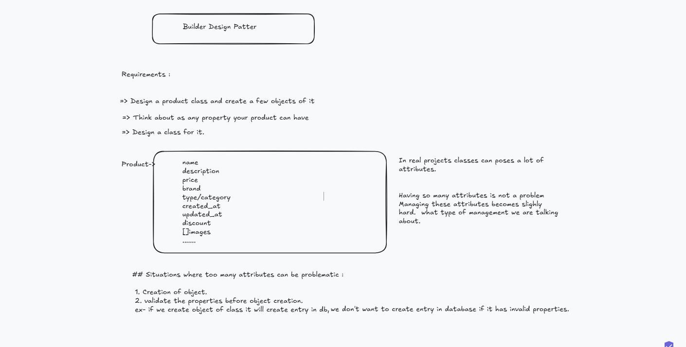

## V1 Solution using getters setters

-> Benefits :
   . Readability
   . Extendability
   . Maintability

-> Issue : 
   1. how to validate input before object creation
   2. It will not work for immutable object creation.

Conclusion : 
  1. just using setters will not work
  2. constructors with too many arguments is problematic

#### what if we have all the arguments which are passed in constructor stored in data structure??

Product(DataStructue{all the arguments}){}

-> data structure we use can be hashmap because we need to map property with value
-> but every key will be having different type of value ex : name is string , but price is integer
-> how about we keep type of value as object.
-> using above approach we solve prblm of bloated constructor , how about validation
-> we can do validation inside constructor before object creation.

#### Problem with hashmap

-> what if hashmap do not have a key as a property.
-> In a hashmap what if there is a spelling mistake.
-> price/Price - we are giving caller of product class to make mistake

#### Alternative Approach : 

what if we use object of other class which has all the same attributes as our product class.

class Builder {
 private string name;
 private string desc;
 private int price;

// implementated solution of getter setter
}

class Product {
 Product(Builder b) {
    this.price = b.getPrice();
  }
}

V3 is builder design pattern (creational design pattern : deals with problem during object creation).
